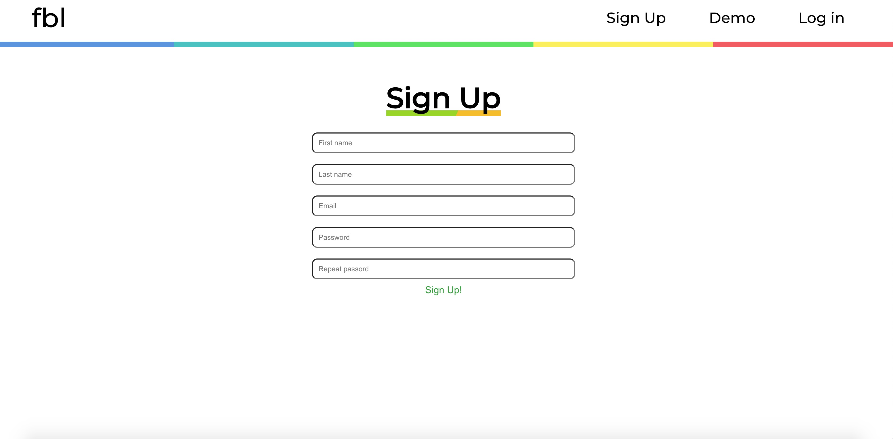
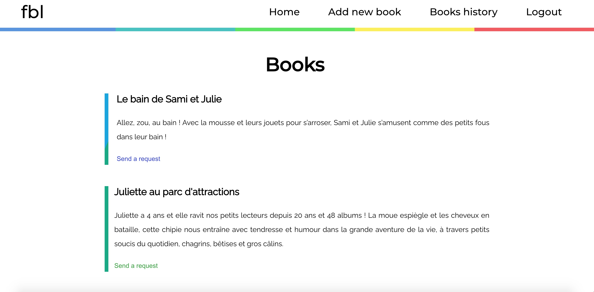
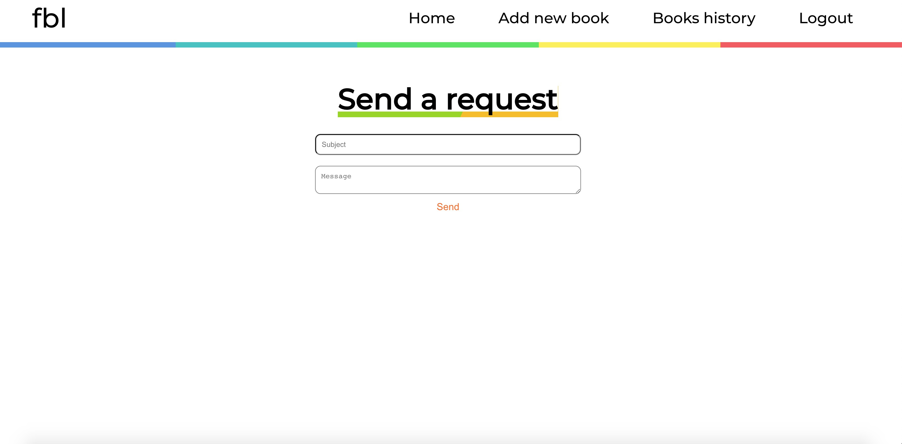

# French Bambin Library
The french bambin library is a french books platform exchange.
It helps connect parents to find and share french learning materials.

## Screenshots

Sign up to get access to the library!

Browse books and send a request when you find one you like.

An email is sent to connect with the owner of the book.

## Features to come:
* Upload pictures of the books
* Searchbar to look for a specific book
* Translate French/English option

## Built with
* React
* Javascript
* CSS
* HTML

## Live App
- [Click here](https://french-bambin-library-app.vercel.app/)
